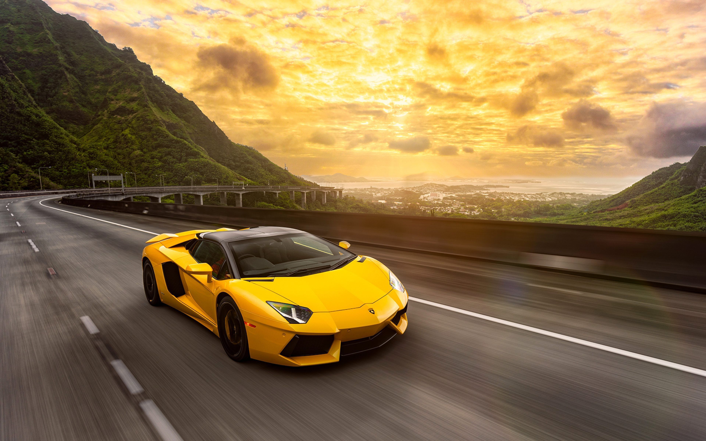

# photos-to-sketches-and-paintings-opencv-python
This repository is for my project where I will be building a photo to sketch image or a painting image converter in OpenCV and Python.
 
Title - Transforming Photos to sketches and Paintings with OpenCV.
 
Description - In this repository, i have built a project to convert a user entered image to it's own sketch or it's waterpaint alternative using OpenCV.  
 
Results --->  
Image - 1  

Result 1.1 - Color Sketch  

Result 1.2 - Waterpainting  

Image - 2  

Result 2.1 - Color Sketch  

Result 2.2 - Waterpainting  

Image - 3  

Result 3.1 - Color Sketch  

Result 3.2 - Waterpainting  

 
All the images have been taken from the internet.  